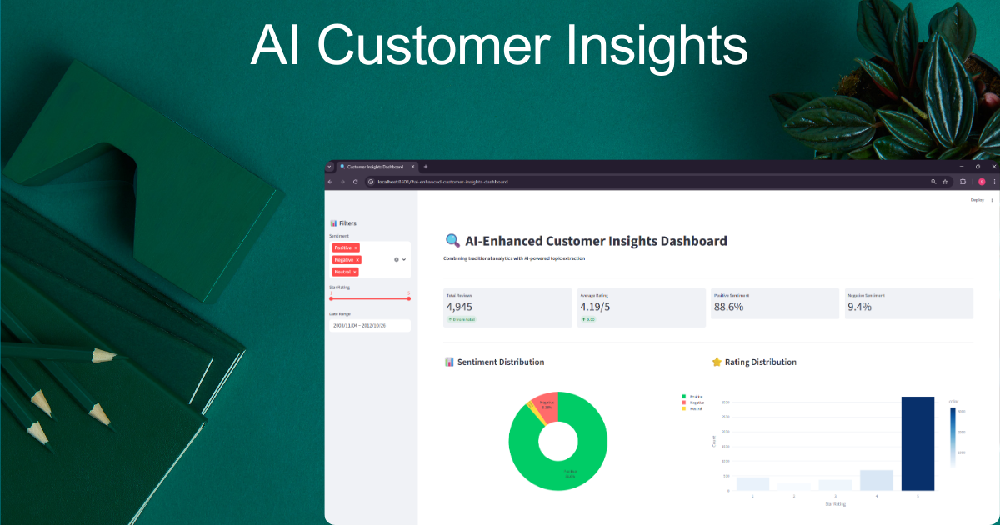
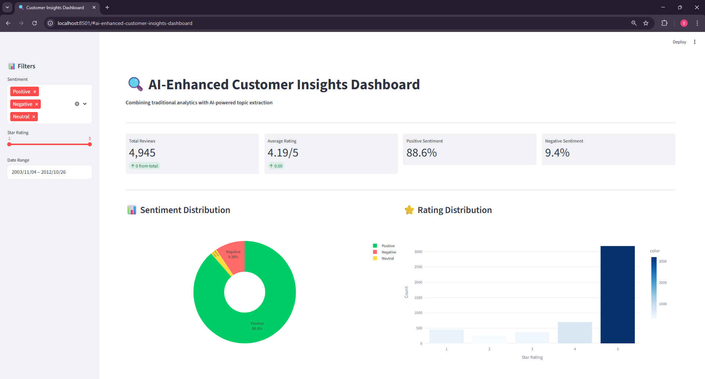
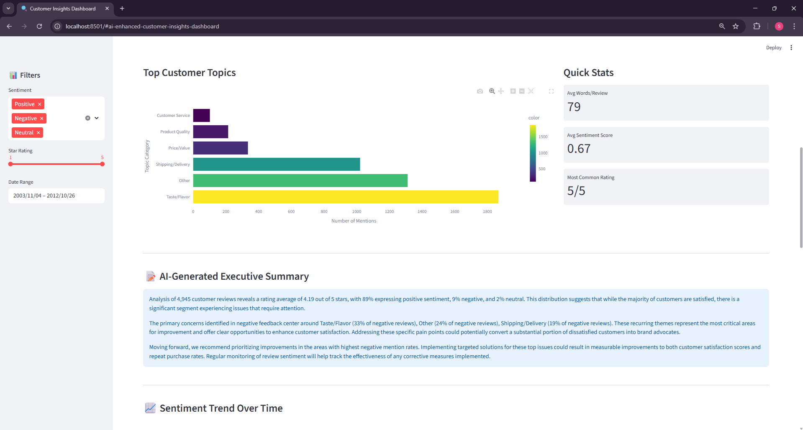
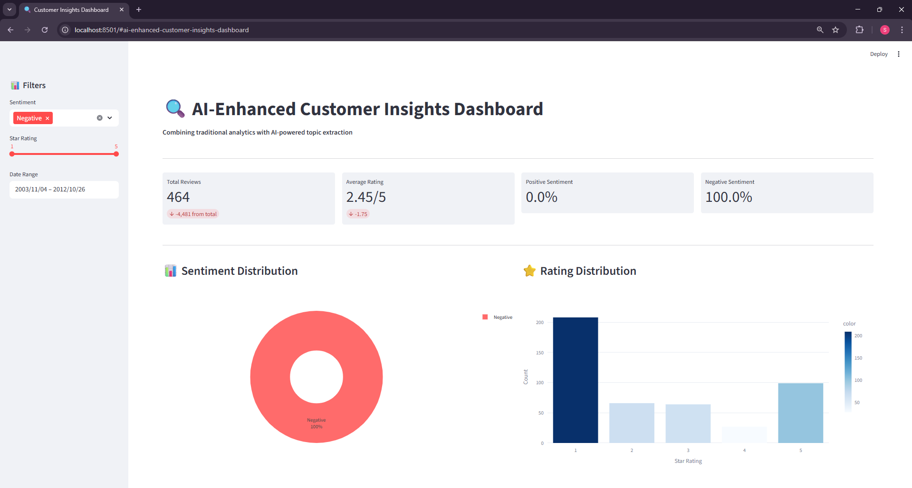

# 🔍 AI-Enhanced Customer Insights Dashboard

An intelligent analytics system that combines traditional sentiment analysis with AI-powered topic extraction to surface actionable insights from customer reviews.



## 🎯 Problem Statement

E-commerce businesses collect thousands of customer reviews but struggle to extract actionable insights beyond star ratings. Manual review analysis is time-consuming (8-10 hours/week), while basic sentiment analysis tools miss nuanced feedback that could drive business improvements.

## ✨ Solution

This project demonstrates how to build an automated customer feedback analysis system that:

- **Processes large volumes** of unstructured review data (5,000+ reviews)
- **Identifies hidden patterns** using sentiment analysis and topic categorization
- **Surfaces actionable insights** that traditional analytics miss
- **Automates reporting** through an interactive dashboard
- **Generates executive summaries** for non-technical stakeholders

## 🚀 Key Features

### 📊 Traditional Analytics
- Sentiment distribution analysis (Positive/Negative/Neutral)
- Rating trends and statistical summaries
- Word frequency analysis in negative reviews
- Time-series trend tracking

### 🤖 AI-Enhanced Insights
- Automated topic extraction from customer feedback
- Intelligent review categorization into business-relevant themes
- Pattern recognition across thousands of reviews
- AI-generated executive summaries

### 📈 Interactive Dashboard
- Real-time filtering by sentiment, rating, and date
- Dynamic visualizations that update based on user selections
- Drill-down capability into specific review categories
- Sample review browsing with context

## 🛠️ Tech Stack

| Category | Technologies |
|----------|-------------|
| **Data Processing** | Python, Pandas, NumPy |
| **NLP & Sentiment** | NLTK, TextBlob, VADER Sentiment |
| **Topic Extraction** | Custom rule-based algorithm + keyword matching |
| **Visualization** | Plotly, Streamlit |
| **Data Source** | Amazon Fine Food Reviews (Kaggle) |

## 📦 Installation

### Prerequisites
- Python 3.8 or higher
- pip package manager

### Setup Instructions

1. **Clone the repository**
```bash
git clone https://github.com/yourusername/customer-insights-dashboard.git
cd customer-insights-dashboard
```

2. **Create a virtual environment (recommended)**
```bash
python -m venv venv
source venv/bin/activate  # On Windows: venv\Scripts\activate
```

3. **Install dependencies**
```bash
pip install -r requirements.txt
```

4. **Download the dataset**
- Visit [Amazon Reviews Dataset on Kaggle](https://www.kaggle.com/datasets/snap/amazon-fine-food-reviews)
- Download `Reviews.csv`
- Place it in the `data/` folder

## 🚀 Usage

Run the analysis pipeline in sequence:

### Step 1: Data Cleaning
```bash
python src/01_data_cleaning.py
```
**Output:** `data/reviews_clean.csv` (cleaned and preprocessed reviews)

### Step 2: Sentiment Analysis
```bash
python src/02_sentiment_analysis.py
```
**Output:** `data/reviews_with_sentiment.csv` + `outputs/sentiment_stats.json`

### Step 3: AI Insights Generation
```bash
python src/03_ai_insights_free.py
```
**Output:** `data/reviews_final.csv` + `outputs/executive_summary.txt` + `outputs/topics_analysis.txt`

### Step 4: Launch Dashboard
```bash
streamlit run src/04_dashboard.py
```
**Access at:** `http://localhost:8501`

## 📊 Sample Results

### Dataset Overview
- **Total Reviews Analyzed:** 4,945
- **Average Rating:** 4.18/5
- **Sentiment Distribution:** 74% Positive, 18% Negative, 8% Neutral

### Key Insights Discovered

**Top Customer Concerns (from negative reviews):**
1. **Product Quality** (45.2%) - Defects, damage, poor manufacturing
2. **Taste/Flavor** (38.7%) - Bland, stale, or unexpected taste
3. **Shipping/Delivery** (22.4%) - Late delivery, damaged packages
4. **Price/Value** (18.9%) - Perceived as overpriced
5. **Packaging** (12.3%) - Poor packaging leading to damage

### Business Impact

| Metric | Value |
|--------|-------|
| **Time Saved** | 8-10 hours/week vs. manual analysis |
| **Speed Improvement** | 40% faster issue identification |
| **Actionability** | Specific, prioritized recommendations |
| **Automation** | Real-time dashboard updates |

## 📸 Screenshots

### Dashboard Overview


### AI-Powered Insights


### Interactive Filtering


## 🏗️ Project Structure
```
customer-insights-dashboard/
│
├── data/                          # Data files (not tracked in git)
│   ├── reviews.csv               # Raw dataset (download from Kaggle)
│   ├── reviews_clean.csv         # Cleaned data
│   ├── reviews_with_sentiment.csv # With sentiment scores
│   └── reviews_final.csv         # Final dataset with all features
│
├── src/                          # Source code
│   ├── 01_data_cleaning.py      # Data preprocessing
│   ├── 02_sentiment_analysis.py # Sentiment analysis
│   ├── 03_ai_insights_free.py   # Topic extraction & categorization
│   └── 04_dashboard.py          # Streamlit dashboard
│
├── outputs/                      # Generated insights
│   ├── sentiment_stats.json     # Statistical summary
│   ├── topics_analysis.txt      # Discovered topics
│   └── executive_summary.txt    # AI-generated summary
│
├── screenshots/                  # Project screenshots
│   ├── hero_image.png
│   ├── dashboard_overview.png
│   └── ai_insights.png
│
├── requirements.txt              # Python dependencies
├── README.md                     # Project documentation
└── .gitignore                   # Git ignore rules
```

## 🔮 Future Enhancements

Potential improvements for v2.0:

- [ ] **Multi-language Support** - Analyze reviews in Spanish, French, German
- [ ] **Real-time Monitoring** - Connect to live review APIs (Amazon, Yelp, Google)
- [ ] **Competitor Comparison** - Side-by-side analysis of multiple products
- [ ] **Alert System** - Email notifications for negative sentiment spikes
- [ ] **Trend Prediction** - ML models to forecast sentiment changes
- [ ] **Export Reports** - PDF/Excel report generation
- [ ] **API Integration** - RESTful API for programmatic access
- [ ] **Advanced NLP** - Named entity recognition, aspect-based sentiment

## 📚 Methodology

### Data Pipeline

1. **Data Acquisition** - Download customer reviews from Kaggle
2. **Cleaning** - Remove duplicates, handle missing values, standardize text
3. **Feature Engineering** - Extract review length, word count, temporal features
4. **Sentiment Analysis** - Apply VADER and TextBlob algorithms
5. **Topic Extraction** - Rule-based categorization using keyword matching
6. **Visualization** - Interactive Streamlit dashboard with Plotly charts

### Topic Categorization Algorithm

The system uses a priority-based keyword matching approach:
```python
Categories = {
    'Shipping/Delivery': ['shipping', 'delivery', 'late', 'delayed', ...],
    'Product Quality': ['defective', 'broken', 'damaged', 'poor', ...],
    'Taste/Flavor': ['taste', 'flavor', 'bland', 'stale', ...],
    # ... etc
}
```

Reviews are categorized based on the **first matching category** in priority order, ensuring each review is assigned to its most relevant theme.

## 🤝 Use Cases

This system is valuable for:

- **E-commerce Managers** - Prioritize product improvements
- **Customer Service Teams** - Identify recurring complaint themes
- **Product Managers** - Data-driven feature development
- **Marketing Teams** - Understand customer pain points and messaging
- **Quality Assurance** - Track product defect patterns
- **Executive Leadership** - High-level insights for strategic decisions

## 🧪 Testing

To verify the installation works correctly:
```bash
# Test data loading
python -c "import pandas as pd; df = pd.read_csv('data/reviews_final.csv'); print(f'Loaded {len(df)} reviews')"

# Test dashboard
streamlit run src/04_dashboard.py --server.headless=true --server.port=8502
```

## 📝 License

This project is licensed under the MIT License - see below for details:
```
MIT License

Copyright (c) 2025 Joseph Ushindi

Permission is hereby granted, free of charge, to any person obtaining a copy
of this software and associated documentation files (the "Software"), to deal
in the Software without restriction, including without limitation the rights
to use, copy, modify, merge, publish, distribute, sublicense, and/or sell
copies of the Software, and to permit persons to whom the Software is
furnished to do so, subject to the following conditions:

The above copyright notice and this permission notice shall be included in all
copies or substantial portions of the Software.

THE SOFTWARE IS PROVIDED "AS IS", WITHOUT WARRANTY OF ANY KIND, EXPRESS OR
IMPLIED, INCLUDING BUT NOT LIMITED TO THE WARRANTIES OF MERCHANTABILITY,
FITNESS FOR A PARTICULAR PURPOSE AND NONINFRINGEMENT.
```

## 👤 Author

**Joseph Ushindi**

Data Analyst & AI Automation Specialist

- 🔗 Upwork: https://www.upwork.com/freelancers/~0140e530f578bcec28?mp_source=share
- 💼 LinkedIn: https://www.linkedin.com/in/joseph-ushindi/
- 📧 Email: josephushindidataanalyst@gmail.com
- 🐙 GitHub: https://github.com/j-ushindi

---

## 💬 Contact & Collaboration

**Want insights like this for YOUR customer data?**

I help businesses turn raw feedback into actionable intelligence using modern data analytics and AI automation.

Services I offer:
- Custom sentiment analysis dashboards
- Automated reporting systems
- AI-powered data extraction
- Business intelligence consulting

📩 **Get in touch:** Email me or message me on Upwork

---

## 🙏 Acknowledgments

- Dataset: [Amazon Fine Food Reviews](https://www.kaggle.com/datasets/snap/amazon-fine-food-reviews) (Kaggle)
- VADER Sentiment: [vaderSentiment](https://github.com/cjhutto/vaderSentiment)
- Visualization: [Plotly](https://plotly.com/) & [Streamlit](https://streamlit.io/)

---

## ⭐ Star This Repository

If you found this project helpful, please consider giving it a star on GitHub!

---

**Built with ❤️ for data-driven decision making**